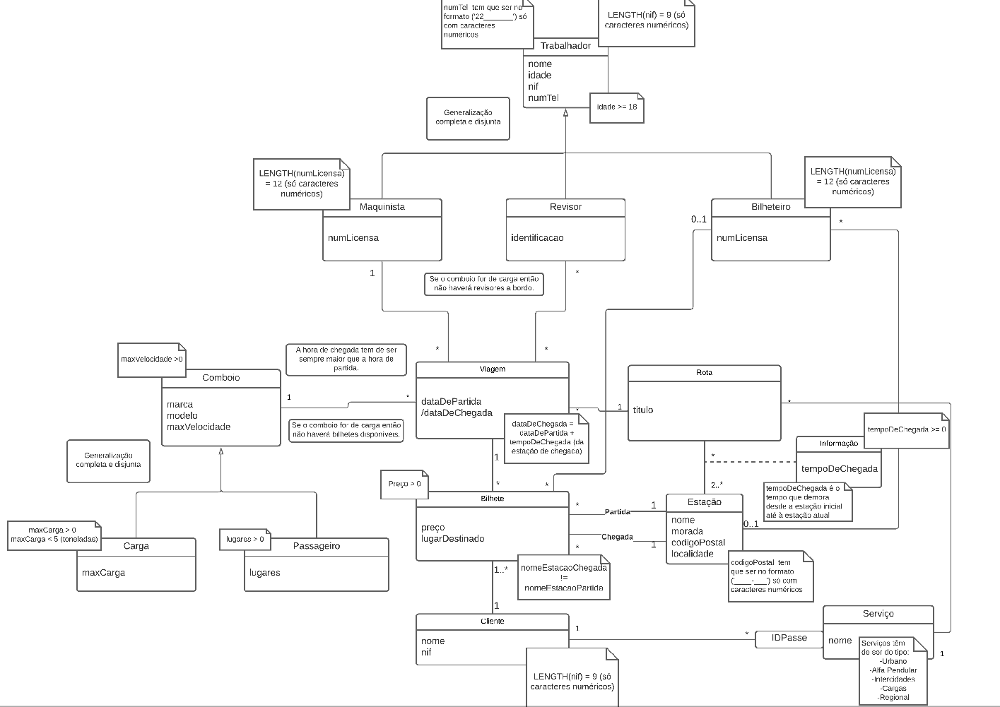

# FEUP-BDAD
**Description** - Database for a railway system, with the respective schema and populate scripts

**Course** - Databases

## Project Overview

The schema includes trains, different routes, stations, intervenients with the trains (different workers and clients), tickets, and all the scheduled stops of the trains in each station.
Furthermore, the project also includes triggers that guarantee the database integrity when an element is dropped.


## Usage

In a database management system, for example, sqlite, run the ``` criar.sql ``` script, followed by ``` povoar.sql```.

## UML


